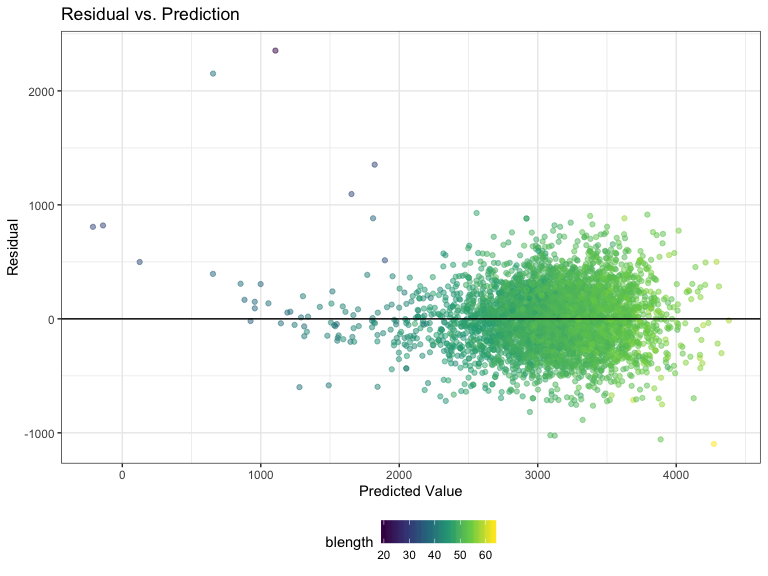
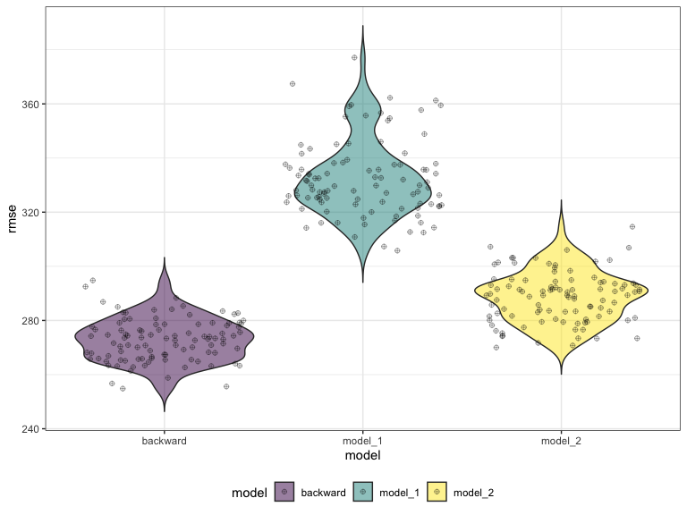
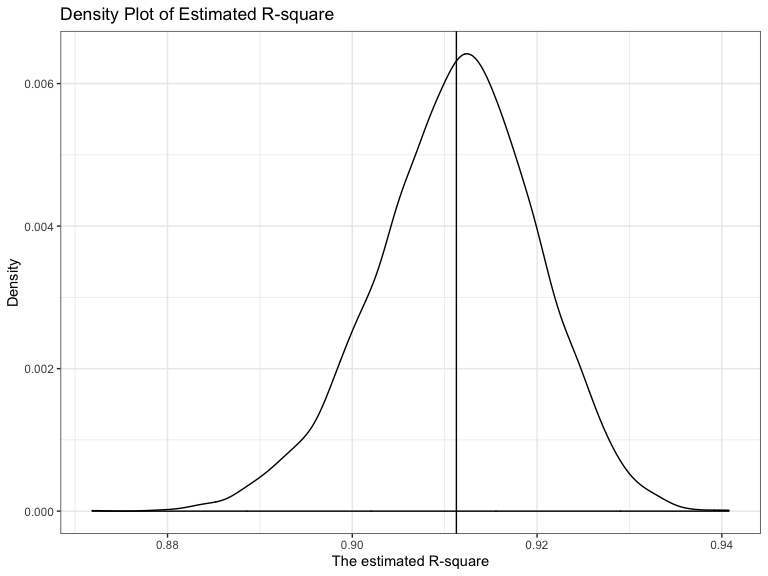
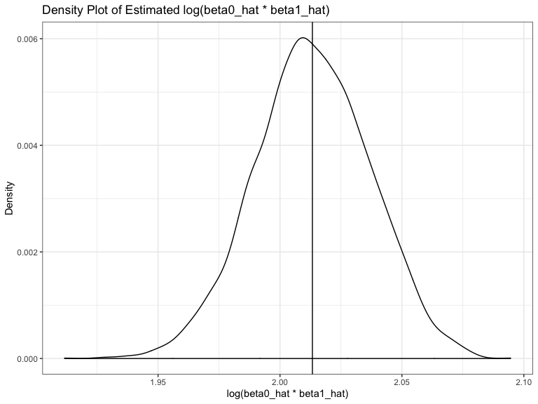

hw6
================
Ran Wang
11/21/2019

``` r
birthweight = read.csv("./datahw6/birthweight.csv") %>% 
  janitor::clean_names() %>% 
  mutate(babysex= as.factor(babysex),
         babysex= recode(babysex,"1"="male","2"="female"),
         frace = as.factor(frace),
         frace = recode(frace,"1" = "White", "2" = "Black", "3" = "Asian", "4" = "Puerto Rican", "8" = "Other", "9" = "Unknown"),
         mrace = as.factor(mrace),
         mrace = recode(mrace,"1" = "White", "2" = "Black", "3" = "Asian", "4" = "Puerto Rican", "8" = "Other", "9" = "Unknown"),
         malform = as.factor(malform),
         malform = recode(malform,"0" = "absent", "1" = "present")
         )
```

The first step is to load and clean the data for regression analysis.
Some numeric variables are converted to factor with ordered levels. And
there are no missing values in the dataset.

``` r
fullmodel <- lm(bwt ~ ., data = birthweight) 
summary(fullmodel)
```

    ## 
    ## Call:
    ## lm(formula = bwt ~ ., data = birthweight)
    ## 
    ## Residuals:
    ##      Min       1Q   Median       3Q      Max 
    ## -1097.68  -184.86    -3.33   173.09  2344.15 
    ## 
    ## Coefficients: (3 not defined because of singularities)
    ##                     Estimate Std. Error t value Pr(>|t|)    
    ## (Intercept)       -6265.3914   660.4011  -9.487  < 2e-16 ***
    ## babysexfemale        28.7073     8.4652   3.391 0.000702 ***
    ## bhead               130.7781     3.4523  37.881  < 2e-16 ***
    ## blength              74.9536     2.0217  37.075  < 2e-16 ***
    ## delwt                 4.1007     0.3948  10.386  < 2e-16 ***
    ## fincome               0.2898     0.1795   1.614 0.106551    
    ## fraceBlack           14.3313    46.1501   0.311 0.756168    
    ## fraceAsian           21.2361    69.2960   0.306 0.759273    
    ## fracePuerto Rican   -46.9962    44.6782  -1.052 0.292912    
    ## fraceOther            4.2969    74.0741   0.058 0.953745    
    ## gaweeks              11.5494     1.4654   7.882 4.06e-15 ***
    ## malformpresent        9.7650    70.6259   0.138 0.890039    
    ## menarche             -3.5508     2.8951  -1.226 0.220083    
    ## mheight               9.7874    10.3116   0.949 0.342588    
    ## momage                0.7593     1.2221   0.621 0.534418    
    ## mraceBlack         -151.4354    46.0453  -3.289 0.001014 ** 
    ## mraceAsian          -91.3866    71.9190  -1.271 0.203908    
    ## mracePuerto Rican   -56.4787    45.1369  -1.251 0.210901    
    ## parity               95.5411    40.4793   2.360 0.018307 *  
    ## pnumlbw                   NA         NA      NA       NA    
    ## pnumsga                   NA         NA      NA       NA    
    ## ppbmi                 4.3538    14.8913   0.292 0.770017    
    ## ppwt                 -3.4716     2.6121  -1.329 0.183913    
    ## smoken               -4.8544     0.5871  -8.269  < 2e-16 ***
    ## wtgain                    NA         NA      NA       NA    
    ## ---
    ## Signif. codes:  0 '***' 0.001 '**' 0.01 '*' 0.05 '.' 0.1 ' ' 1
    ## 
    ## Residual standard error: 272.5 on 4320 degrees of freedom
    ## Multiple R-squared:  0.7183, Adjusted R-squared:  0.717 
    ## F-statistic: 524.6 on 21 and 4320 DF,  p-value: < 2.2e-16

``` r
step(fullmodel,direction = "backward") 
```

    ## Start:  AIC=48717.83
    ## bwt ~ babysex + bhead + blength + delwt + fincome + frace + gaweeks + 
    ##     malform + menarche + mheight + momage + mrace + parity + 
    ##     pnumlbw + pnumsga + ppbmi + ppwt + smoken + wtgain
    ## 
    ## 
    ## Step:  AIC=48717.83
    ## bwt ~ babysex + bhead + blength + delwt + fincome + frace + gaweeks + 
    ##     malform + menarche + mheight + momage + mrace + parity + 
    ##     pnumlbw + pnumsga + ppbmi + ppwt + smoken
    ## 
    ## 
    ## Step:  AIC=48717.83
    ## bwt ~ babysex + bhead + blength + delwt + fincome + frace + gaweeks + 
    ##     malform + menarche + mheight + momage + mrace + parity + 
    ##     pnumlbw + ppbmi + ppwt + smoken
    ## 
    ## 
    ## Step:  AIC=48717.83
    ## bwt ~ babysex + bhead + blength + delwt + fincome + frace + gaweeks + 
    ##     malform + menarche + mheight + momage + mrace + parity + 
    ##     ppbmi + ppwt + smoken
    ## 
    ##            Df Sum of Sq       RSS   AIC
    ## - frace     4    124365 320848704 48712
    ## - malform   1      1419 320725757 48716
    ## - ppbmi     1      6346 320730684 48716
    ## - momage    1     28661 320752999 48716
    ## - mheight   1     66886 320791224 48717
    ## - menarche  1    111679 320836018 48717
    ## - ppwt      1    131132 320855470 48718
    ## <none>                  320724338 48718
    ## - fincome   1    193454 320917792 48718
    ## - parity    1    413584 321137922 48721
    ## - mrace     3    868321 321592659 48724
    ## - babysex   1    853796 321578134 48727
    ## - gaweeks   1   4611823 325336161 48778
    ## - smoken    1   5076393 325800732 48784
    ## - delwt     1   8008891 328733230 48823
    ## - blength   1 102050296 422774634 49915
    ## - bhead     1 106535716 427260054 49961
    ## 
    ## Step:  AIC=48711.51
    ## bwt ~ babysex + bhead + blength + delwt + fincome + gaweeks + 
    ##     malform + menarche + mheight + momage + mrace + parity + 
    ##     ppbmi + ppwt + smoken
    ## 
    ##            Df Sum of Sq       RSS   AIC
    ## - malform   1      1447 320850151 48710
    ## - ppbmi     1      6975 320855679 48710
    ## - momage    1     28379 320877083 48710
    ## - mheight   1     69502 320918206 48710
    ## - menarche  1    115708 320964411 48711
    ## - ppwt      1    133961 320982665 48711
    ## <none>                  320848704 48712
    ## - fincome   1    194405 321043108 48712
    ## - parity    1    414687 321263390 48715
    ## - babysex   1    852133 321700837 48721
    ## - gaweeks   1   4625208 325473911 48772
    ## - smoken    1   5036389 325885093 48777
    ## - delwt     1   8013099 328861802 48817
    ## - mrace     3  13540415 334389119 48885
    ## - blength   1 101995688 422844392 49908
    ## - bhead     1 106662962 427511666 49956
    ## 
    ## Step:  AIC=48709.53
    ## bwt ~ babysex + bhead + blength + delwt + fincome + gaweeks + 
    ##     menarche + mheight + momage + mrace + parity + ppbmi + ppwt + 
    ##     smoken
    ## 
    ##            Df Sum of Sq       RSS   AIC
    ## - ppbmi     1      6928 320857079 48708
    ## - momage    1     28660 320878811 48708
    ## - mheight   1     69320 320919470 48708
    ## - menarche  1    116027 320966177 48709
    ## - ppwt      1    133894 320984044 48709
    ## <none>                  320850151 48710
    ## - fincome   1    193784 321043934 48710
    ## - parity    1    414482 321264633 48713
    ## - babysex   1    851279 321701430 48719
    ## - gaweeks   1   4624003 325474154 48770
    ## - smoken    1   5035195 325885346 48775
    ## - delwt     1   8029079 328879230 48815
    ## - mrace     3  13553320 334403471 48883
    ## - blength   1 102009225 422859375 49906
    ## - bhead     1 106675331 427525481 49954
    ## 
    ## Step:  AIC=48707.63
    ## bwt ~ babysex + bhead + blength + delwt + fincome + gaweeks + 
    ##     menarche + mheight + momage + mrace + parity + ppwt + smoken
    ## 
    ##            Df Sum of Sq       RSS   AIC
    ## - momage    1     29211 320886290 48706
    ## - menarche  1    117635 320974714 48707
    ## <none>                  320857079 48708
    ## - fincome   1    195199 321052278 48708
    ## - parity    1    412984 321270064 48711
    ## - babysex   1    850020 321707099 48717
    ## - mheight   1   1078673 321935752 48720
    ## - ppwt      1   2934023 323791103 48745
    ## - gaweeks   1   4621504 325478583 48768
    ## - smoken    1   5039368 325896447 48773
    ## - delwt     1   8024939 328882018 48813
    ## - mrace     3  13551444 334408523 48881
    ## - blength   1 102018559 422875638 49904
    ## - bhead     1 106821342 427678421 49953
    ## 
    ## Step:  AIC=48706.02
    ## bwt ~ babysex + bhead + blength + delwt + fincome + gaweeks + 
    ##     menarche + mheight + mrace + parity + ppwt + smoken
    ## 
    ##            Df Sum of Sq       RSS   AIC
    ## - menarche  1    100121 320986412 48705
    ## <none>                  320886290 48706
    ## - fincome   1    240800 321127090 48707
    ## - parity    1    431433 321317724 48710
    ## - babysex   1    841278 321727568 48715
    ## - mheight   1   1076739 321963029 48719
    ## - ppwt      1   2913653 323799943 48743
    ## - gaweeks   1   4676469 325562760 48767
    ## - smoken    1   5045104 325931394 48772
    ## - delwt     1   8000672 328886962 48811
    ## - mrace     3  14667730 335554021 48894
    ## - blength   1 101990556 422876847 49902
    ## - bhead     1 106864308 427750598 49952
    ## 
    ## Step:  AIC=48705.38
    ## bwt ~ babysex + bhead + blength + delwt + fincome + gaweeks + 
    ##     mheight + mrace + parity + ppwt + smoken
    ## 
    ##           Df Sum of Sq       RSS   AIC
    ## <none>                 320986412 48705
    ## - fincome  1    245637 321232048 48707
    ## - parity   1    422770 321409181 48709
    ## - babysex  1    846134 321832545 48715
    ## - mheight  1   1012240 321998651 48717
    ## - ppwt     1   2907049 323893461 48743
    ## - gaweeks  1   4662501 325648912 48766
    ## - smoken   1   5073849 326060260 48771
    ## - delwt    1   8137459 329123871 48812
    ## - mrace    3  14683609 335670021 48894
    ## - blength  1 102191779 423178191 49903
    ## - bhead    1 106779754 427766166 49950

    ## 
    ## Call:
    ## lm(formula = bwt ~ babysex + bhead + blength + delwt + fincome + 
    ##     gaweeks + mheight + mrace + parity + ppwt + smoken, data = birthweight)
    ## 
    ## Coefficients:
    ##       (Intercept)      babysexfemale              bhead            blength  
    ##         -6098.822             28.558            130.777             74.947  
    ##             delwt            fincome            gaweeks            mheight  
    ##             4.107              0.318             11.592              6.594  
    ##        mraceBlack         mraceAsian  mracePuerto Rican             parity  
    ##          -138.792            -74.887           -100.678             96.305  
    ##              ppwt             smoken  
    ##            -2.676             -4.843

``` r
#final model
linear_model = lm(bwt ~ babysex + bhead + blength + delwt + fincome + 
    gaweeks + mheight + mrace + parity + ppwt + smoken, data = birthweight) 

summary(linear_model)
```

    ## 
    ## Call:
    ## lm(formula = bwt ~ babysex + bhead + blength + delwt + fincome + 
    ##     gaweeks + mheight + mrace + parity + ppwt + smoken, data = birthweight)
    ## 
    ## Residuals:
    ##      Min       1Q   Median       3Q      Max 
    ## -1097.18  -185.52    -3.39   174.14  2353.44 
    ## 
    ## Coefficients:
    ##                     Estimate Std. Error t value Pr(>|t|)    
    ## (Intercept)       -6098.8219   137.5463 -44.340  < 2e-16 ***
    ## babysexfemale        28.5580     8.4549   3.378 0.000737 ***
    ## bhead               130.7770     3.4466  37.944  < 2e-16 ***
    ## blength              74.9471     2.0190  37.120  < 2e-16 ***
    ## delwt                 4.1067     0.3921  10.475  < 2e-16 ***
    ## fincome               0.3180     0.1747   1.820 0.068844 .  
    ## gaweeks              11.5925     1.4621   7.929 2.79e-15 ***
    ## mheight               6.5940     1.7849   3.694 0.000223 ***
    ## mraceBlack         -138.7925     9.9071 -14.009  < 2e-16 ***
    ## mraceAsian          -74.8868    42.3146  -1.770 0.076837 .  
    ## mracePuerto Rican  -100.6781    19.3247  -5.210 1.98e-07 ***
    ## parity               96.3047    40.3362   2.388 0.017004 *  
    ## ppwt                 -2.6756     0.4274  -6.261 4.20e-10 ***
    ## smoken               -4.8434     0.5856  -8.271  < 2e-16 ***
    ## ---
    ## Signif. codes:  0 '***' 0.001 '**' 0.01 '*' 0.05 '.' 0.1 ' ' 1
    ## 
    ## Residual standard error: 272.3 on 4328 degrees of freedom
    ## Multiple R-squared:  0.7181, Adjusted R-squared:  0.7173 
    ## F-statistic: 848.1 on 13 and 4328 DF,  p-value: < 2.2e-16

The backward (step-dwon) selection is applied to generate an ideal
regression model for birthweight.The model starts with all candidate
variables listed in the dataset.The significant level is set at 0.05. At
each step of selection, the variable that is the least significant is
removed. This process continues until no nonsignificant variables
remain. In R, the output shows the value of Akaike information criterion
(AIC) at each step, the goal of backward elimination is to select the
model with lowest AIC. According to R output, the birthweight is best to
be predicted by variables including babysex,bhead, blength, delwt,
fincome,gaweeks, mheight, mrace, parity, ppwt and smoking status. This
final model has the lowest AIC which is 48705.38.

``` r
#calculate the residual and predicted value
residual = modelr::add_residuals(birthweight, linear_model)
prediction = modelr::add_predictions(birthweight, linear_model)

#join the above two datasets
residual_prediction = full_join(residual,prediction)
```

    ## Joining, by = c("babysex", "bhead", "blength", "bwt", "delwt", "fincome", "frace", "gaweeks", "malform", "menarche", "mheight", "momage", "mrace", "parity", "pnumlbw", "pnumsga", "ppbmi", "ppwt", "smoken", "wtgain")

``` r
#show a plot of model residuals against fitted values 
plot1 = residual_prediction %>% 
   ggplot(aes(x = pred, y = resid,color = blength)) +
  geom_point(alpha = 0.5) +
  labs(
    title = "Residual vs. Prediction",
    x = "Predicted Value",
    y = "Residual") +
  geom_hline(aes(yintercept = 0), color = "black")
  
plot1
```



The above plot shows that model residuals against fitted values. As
shown in the graph, the majority of residuals are around the 0-axis,
which indicates the model is a good fit in describing the relationship
between x and y.

Comparing the model generated by backward selection and the following
two models:

1),One using length at birth and gestational age as predictors (main
effects only) 2),One using head circumference, length, sex, and all
interactions (including the three-way interaction) between these

``` r
cv_df =
  crossv_mc(birthweight, 100) %>% 
  mutate(
    train = map(train, as_tibble),
    test = map(test, as_tibble))

#calculate the rmse of these three models
cv_df = 
  cv_df %>% 
  mutate(backward_model  = map(train, ~lm(bwt ~ babysex + bhead + blength + delwt + fincome + gaweeks + mheight + mrace + parity + ppwt + smoken, data = .x)),
         model_1  = map(train,~lm(bwt ~ blength + gaweeks, data = .x)),
         model_2  = map(train, ~lm(bwt ~ bhead * blength + bhead * babysex + babysex * blength + bhead * babysex * blength, data = .x))) %>%
  mutate(rmse_backward = map2_dbl(backward_model, test, ~rmse(model = .x, data = .y)),
         rmse_model_1 = map2_dbl(model_1, test, ~rmse(model = .x, data = .y)),
         rmse_model_2 = map2_dbl(model_2, test, ~rmse(model = .x, data = .y))
         )
  
cv_df  
```

    ## # A tibble: 100 x 9
    ##    train test  .id   backward_model model_1 model_2 rmse_backward rmse_model_1
    ##    <lis> <lis> <chr> <list>         <list>  <list>          <dbl>        <dbl>
    ##  1 <tib… <tib… 001   <lm>           <lm>    <lm>             279.         360.
    ##  2 <tib… <tib… 002   <lm>           <lm>    <lm>             265.         322.
    ##  3 <tib… <tib… 003   <lm>           <lm>    <lm>             263.         307.
    ##  4 <tib… <tib… 004   <lm>           <lm>    <lm>             284.         337.
    ##  5 <tib… <tib… 005   <lm>           <lm>    <lm>             285.         367.
    ##  6 <tib… <tib… 006   <lm>           <lm>    <lm>             268.         314.
    ##  7 <tib… <tib… 007   <lm>           <lm>    <lm>             275.         357.
    ##  8 <tib… <tib… 008   <lm>           <lm>    <lm>             283.         346.
    ##  9 <tib… <tib… 009   <lm>           <lm>    <lm>             269.         327.
    ## 10 <tib… <tib… 010   <lm>           <lm>    <lm>             271.         338.
    ## # … with 90 more rows, and 1 more variable: rmse_model_2 <dbl>

``` r
#draw a violin plot to compare the rmse of three models
plot2 = cv_df  %>% 
  select(starts_with("rmse")) %>% 
  pivot_longer(
    everything(),
    names_to = "model", 
    values_to = "rmse",
    names_prefix = "rmse_") %>% 
  mutate(model = fct_inorder(model)) %>% 
  ggplot(aes(x = model, y = rmse, fill = model)) +
  geom_violin(trim = FALSE, alpha = 0.5) +
  geom_jitter(shape = 10,  alpha = 0.35) 

plot2
```



As shown in the violin plot, the model that generated by the backward
selection has the lowest rmse. The model using length at birth and
gestational age as predictors (main effects only) has the highest rmse,
which means length at birth and gestational age might not be good
predictors for baby’s birthweight. Thus, the model generated by backward
selection is the best model to describe the relationship between outcome
and predictors. In other words, predictors in the model can best predict
the birthweight.

## Probelm 2

``` r
#read the weather dataset
weather_df = 
  rnoaa::meteo_pull_monitors(
    c("USW00094728"),
    var = c("PRCP", "TMIN", "TMAX"), 
    date_min = "2017-01-01",
    date_max = "2017-12-31") %>%
  mutate(
    name = recode(id, USW00094728 = "CentralPark_NY"),
    tmin = tmin / 10,
    tmax = tmax / 10) %>%
  select(name, id, everything())
```

    ## Registered S3 method overwritten by 'crul':
    ##   method                 from
    ##   as.character.form_file httr

    ## Registered S3 method overwritten by 'hoardr':
    ##   method           from
    ##   print.cache_info httr

    ## file path:          /Users/daniel/Library/Caches/rnoaa/ghcnd/USW00094728.dly

    ## file last updated:  2019-10-07 21:34:12

    ## file min/max dates: 1869-01-01 / 2019-10-31

``` r
#Use a 5000-bootstrap sample to produce the estimnated r square
bootstrap_sample = weather_df %>% 
  modelr::bootstrap(n = 5000) %>% 
  mutate(
        models = map(strap, ~lm(tmax ~ tmin, data = .x)),
        results = map(models, broom::tidy),
        var = map(models, broom::glance)
        ) %>% 
  select(-strap, -models) %>% 
  unnest(results,var)

#Plot the distribution of estimnated r square
plot_r_squared = bootstrap_sample %>% 
  filter(term == "tmin") %>% 
  ggplot(aes(x = r.squared)) + 
  geom_density(aes(y = stat(count / sum(count)))) +
  labs(
    title = "Density Plot of Estimated R-square",
    x = "The estimated R-square",
    y = "Density") +
  geom_vline(aes(xintercept = mean(r.squared)))

plot_r_squared 
```



As shown on the plot above, the distribution of estimated R-square might
be approximately normal,with a black line indicating the mean value of
estimated
R-square.

``` r
#Using the 5000 bootstrap estimates, identify the 2.5% and 97.5% quantiles to provide a 95% confidence interval for estimated r square
ci_r_squared = bootstrap_sample %>% 
  filter(term == "tmin") %>% 
  pull(var = r.squared) %>% 
  quantile(c(0.025, 0.975))

ci_r_squared %>% 
  broom::tidy() %>% 
  knitr::kable(digits = 3)
```

| names |     x |
| :---- | ----: |
| 2.5%  | 0.893 |
| 97.5% | 0.927 |

The 95% confidence interval for estimated R-square is between 0.893 and
0.927.

``` r
#Use a 5000-bootstrap sample to produce the estimated log(beta0_hat * beta1_hat)
bootstrap_sample2 = bootstrap_sample %>% 
  select(.id, term, estimate) %>% 
  pivot_wider(
    id_cols = .id,
    names_from = term,
    values_from = estimate
  ) %>% 
  janitor::clean_names() %>% 
  mutate(log = log(intercept * tmin))

#Plot the distribution of estimated log(beta0_hat * beta1_hat)
plot_log = bootstrap_sample2 %>% 
  ggplot(aes(x = log)) + 
  geom_density(aes(y = stat(count / sum(count)))) +
  labs(
    title = "Density Plot of Estimated log(beta0_hat * beta1_hat)",
    x = "log(beta0_hat * beta1_hat)",
    y = "Density") +
   geom_vline(aes(xintercept = mean(log)))

plot_log
```



As shown on the plot above, the distribution of estimated log(beta0\_hat
\* beta1\_hat) might be approximately normal, with a black line
indicating the mean value of estimated log(beta0\_hat \* beta1\_hat).
Compared to the distribution of estimated R-square, it is slightly left
skewed, which suggests that there are more lower values than higher
values.

``` r
#Using the 5000 bootstrap estimates, identify the 2.5% and 97.5% quantiles to provide a 95% confidence interval for estimated log(beta0_hat * beta1_hat)
ci_log = bootstrap_sample2 %>% 
  pull(log) %>% 
  quantile(c(0.025, 0.975))

ci_log %>% 
  broom::tidy() %>% 
  knitr::kable(digits = 3)
```

| names |     x |
| :---- | ----: |
| 2.5%  | 1.966 |
| 97.5% | 2.058 |

The 95% confidence interval for estimated R-square is between 1.966 and
2.058.
